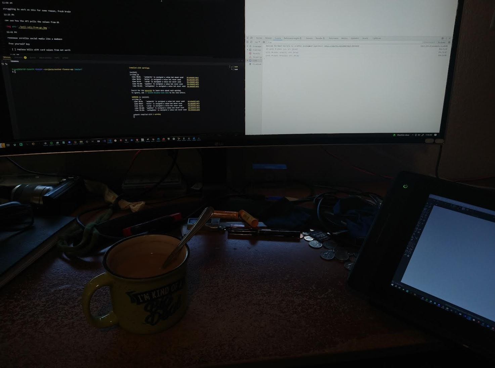
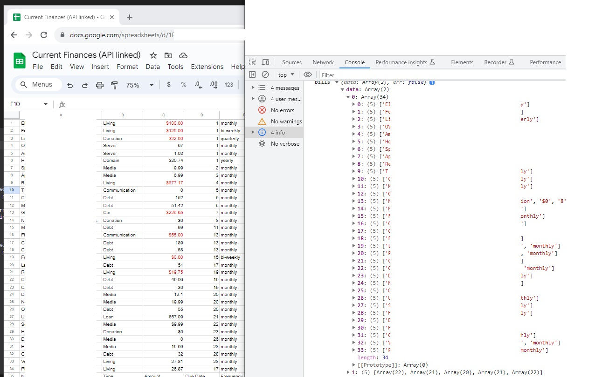

**09/24/2023**

11:44 AM

Alright, back on, I have to achieve something today, for my weekend to not feel like a waste

Hopefully two things:

- this app
- RN app

waiting for coffee to brew right now

11:56 AM

Alright... got my coffee with hazelnut dry creamer (sweetened) and future funk let's go

right now I already have at least 3 credit cards over the limit, I'm in this cycle where I can't pay the balance down enough where the monthly interest doesn't go over the limit

I really wish I had my digital drawing tools... like remarkable or a tablet

I still have a kamvas pro graphics tablet but the angled drawing isn't great, I mostly use it as a second monitor

For some reason win 10 explorer keeps crashing, the search bar, harder to open apps

12:01 PM

alright starting...

12:23 PM

It's hard looking at a blank canvas like what will be there?

12:39 PM

alright I've got that filtered down

12:41 PM

Eventually I can start to see the pieces I want

Like a key goal is "can I afford my bills up to my next paycheck"

So that would be a time block thing, need to pull down month, weeks start/end based on sun/sat, put in a pay date/frequency, how much... then it would figure that out for you

There are little discrepencies too though, like I donate to Mobian and it's quarterly I think, can either program that or just sum it for a year or whatever... those kind of decisions that throw it off.

12:53 AM

Everytime I work on these apps I feel like I'm remaking google spreadsheet ha

what is the value sell

1:04 PM

lol back to html tables, but it's good for copy/paste into a spreadsheet

---

**09/23/2023**

11:58 AM

struggling to work on this for some reason, fresh brain

12:25 PM

can see how the API pulls the values from GS

12:42 PM

reeeeeee scrollin social media like a dumbass

free yourself boy

- [ ] replace bills with card values from net worth

1:15 PM

damn... I've lost motivation

didn't have a goal in mind/aimless

I will at least format this data

1:37 PM

I'm jonesin for some starfield but been too poor to buy it lol, I got AC6 though.

I will use this to check if I can get it or not

1:49 PM

I do miss working on hardware projects, remote or unemployed was nice, damn
